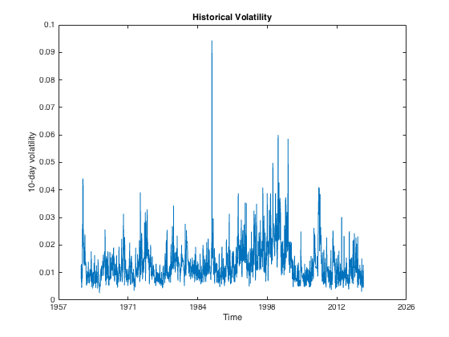

## IBM
###### Applications

---

### Table of contents

1. [All historical data](#all-historical-data)

---

### All historical data

We start by considering the whole historical data we have available from [Yahoo! Finance](https://finance.yahoo.com/quote/IBM?p=IBM), ranging from January 2, 1962 to October 2, 2016. In `figure 1`, the raw historical prices are plotted against the time alongside a **5th** degree polynomial fit.

##### Figure 1 - Raw historical prices

Thus, if we subtract the fitted curve from the raw historical prices, we obtain the detrended plot in `figure 2`.

##### Figure 2 - Detrended prices

But the data is still not uniform enough to conduct a decent analysis, so we change the strategy and rescale the data as well in order to obtain the plot in `figure 3`. This is performed by the [preProcess](https://github.com/joaocarmo/market-reconstruction/wiki/preProcess) function.

##### Figure 3 - Rescaled prices

We are now able to use the rescaled data to perform our analysis. In `figure 4` we have plotted the 1-day returns as computed by the [nDayReturns](https://github.com/joaocarmo/market-reconstruction/wiki/nDayReturns) function.

##### Figure 4 - Historical returns

And if we plot the 1-day returns against themselves on a [r(t), r(t+1)] phase space, we observe the `figure 5` centered around the origin.

##### Figure 5 - Historical returns on a phase space

Now that we have the returns, we can also plot the historical price volatility as in `figure 6`. The results are computed by the [histVol](https://github.com/joaocarmo/market-reconstruction/wiki/histVol) function using a time window of **10** days.

##### Figure 6 - Historical volatility

By successively summing the historical volatility, we find the accumulated historical volatility and plot it in `figure 7`.

##### Figure 7 - Accumulated historical volatility

Next, we find the 1-day returns on a time offset of **50** days and plot the results in `figure 8`. Computations are done through the [correlate](https://github.com/joaocarmo/market-reconstruction/wiki/correlate) function.

##### Figure 8 - Returns correlations

