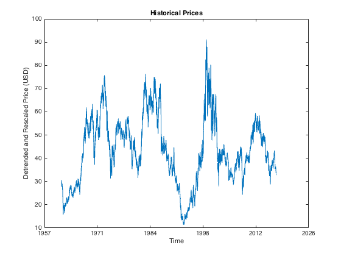
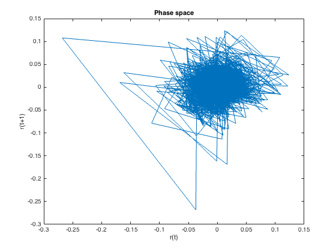
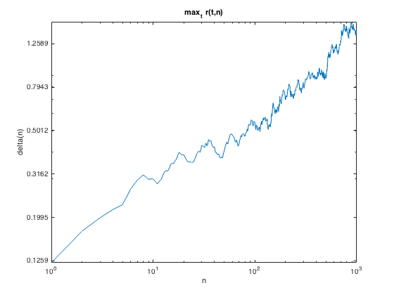
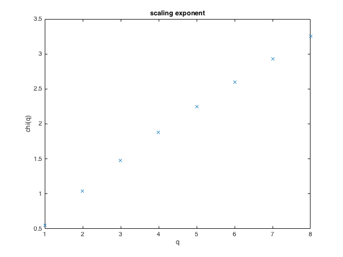
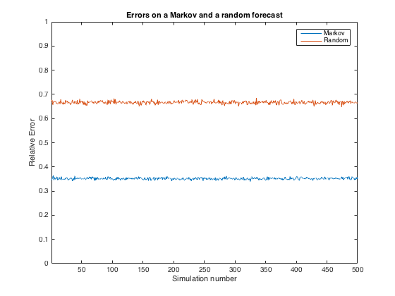

## IBM
###### Applications

---

### Table of contents

1. [All historical data](#all-historical-data)
2. [A K=2 reconstruction](#a-k2-reconstruction)
3. [The K>2 reconstruction](#the-k2-reconstruction)

---

### All historical data

We start by considering the whole historical data we have available from [Yahoo! Finance](https://finance.yahoo.com/quote/IBM?p=IBM), ranging from January 2, 1962 to October 2, 2016. In `figure 1`, the raw historical prices are plotted against the time alongside a **5th** degree polynomial fit.

##### Figure 1 - Raw historical prices


Thus, if we subtract the fitted curve from the raw historical prices, we obtain the detrended plot in `figure 2`.

##### Figure 2 - Detrended prices


But the data is still not uniform enough to conduct a decent analysis, so we change the strategy and rescale the data as well in order to obtain the plot in `figure 3`. This is performed by the [preProcess](https://github.com/joaocarmo/market-reconstruction/wiki/preProcess) function.

##### Figure 3 - Rescaled prices


We are now able to use the rescaled data to perform our analysis. In `figure 4` we have plotted the 1-day returns as computed by the [nDayReturns](https://github.com/joaocarmo/market-reconstruction/wiki/nDayReturns) function.

##### Figure 4 - Historical returns


And if we plot the 1-day returns against themselves on a [r(t), r(t+1)] phase space, we observe the `figure 5` centered around the origin.

##### Figure 5 - Historical returns on a phase space


Now that we have the returns, we can also plot the historical price volatility as in `figure 6`. The results are computed by the [histVol](https://github.com/joaocarmo/market-reconstruction/wiki/histVol) function using a time window of **10** days.

##### Figure 6 - Historical volatility


By successively summing the historical volatility, we find the accumulated historical volatility and plot it in `figure 7`.

##### Figure 7 - Accumulated historical volatility


Next, we find the 1-day returns on a time offset of **50** days and plot the results in `figure 8`. Computations are done through the [correlate](https://github.com/joaocarmo/market-reconstruction/wiki/correlate) function.

##### Figure 8 - Returns correlations


The [delta](https://github.com/joaocarmo/market-reconstruction/wiki/delta) function outputs the result in `figure 9` for 1-day, 2-day, ..., 1000-day returns.

##### Figure 9 — Deltas


We compute the first 8 q-order moments using the [moments_q](https://github.com/joaocarmo/market-reconstruction/wiki/moments_q) function and these are visible in `figure 10`.

##### Figure 10


Finally, we can take the q-order moments that we calculated previously and find the Chi(q) with the [chiOfS](https://github.com/joaocarmo/market-reconstruction/wiki/chiOfS) function and the exponents are plotted in `figure 11`.

##### Figure 11


### A K=2 reconstruction

If we consider only _the previous day price_ when building the Markov probability matrix with the [markovMatrix](https://github.com/joaocarmo/market-reconstruction/wiki/markovMatrix) function and we use an alphabet of length **3**, we get the following Markov matrix values for the **first half** of the time period considered:

```
0.1728    0.1114    0.1667
0.6256    0.7871    0.6480
0.2016    0.1015    0.1853
```

And the accumulated Markov matrix for the same values is thus:

```
0.1728    0.1114    0.1667
0.7984    0.8985    0.8147
1.0000    1.0000    1.0000
```

The rows represent the day we're considering and the columns the previous day in the following order:

```
Alphabet coding for today (X) or yesterday (Y)
1 - Price goes down
2 - Price stays the same
3 - Price goes up
```

Then, we can simply call the probability P( X | Y ) using the matrix index (X,Y). We can clearly see that the probability of staying the same (within one standard deviation from the mean) is the highest.

The [countError](https://github.com/joaocarmo/market-reconstruction/wiki/countError) function outputs the following values when comparing the forecast array with the second half on the historical price data and a randomly generated array in the same way. This was done for a total of 500 simulations.

```
Using Markov, the mean error is 0.33471

With a random forecast, the mean error is 0.66663
```

And the error of each of the 500 simulations for the Markov generated sequence and the randomly generated sequence is plotted in `figure 12`.

##### Figure 12 — The error of 500 simulations


### The K>2 reconstruction
